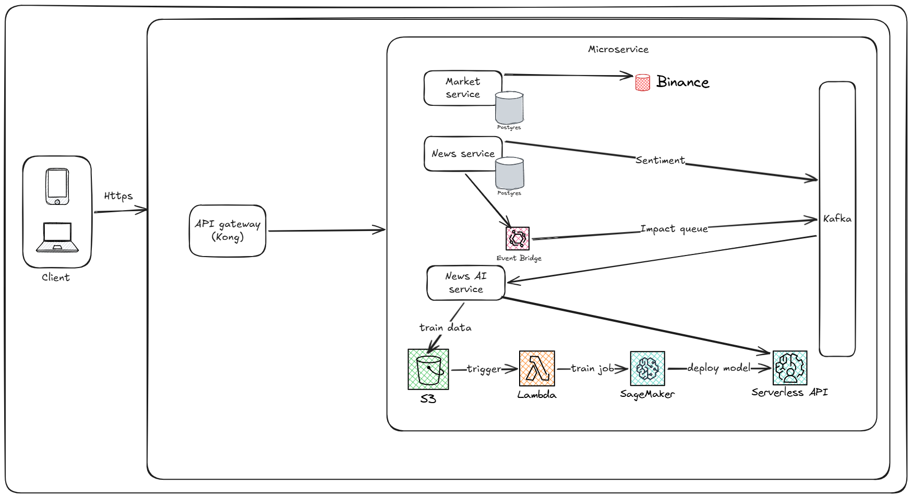
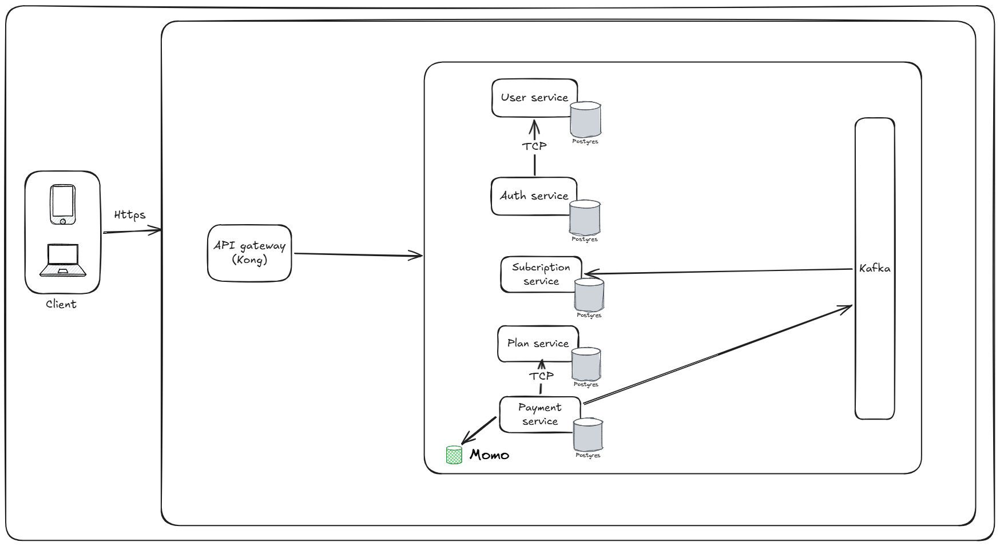

# Nền Tảng Phân Tích Giá Crypto với Tin Tức và AI

Dự án này triển khai hệ thống phân tích giá crypto kết hợp tin tức tài chính và mô hình AI. Người dùng có thể xem biểu đồ giá real-time, theo dõi tin tức từ nhiều nguồn, và (nếu là VIP) xem kết quả phân tích AI dự báo xu hướng giá.

## Video Demo

- Demo hệ thống: https://www.youtube.com/watch?v=fEIBUuV31ck

## Kiến trúc hệ thống

Hệ thống bao gồm nhiều service NodeJS/NestJS chuyên biệt, mỗi service đảm nhận một nhiệm vụ cụ thể:

**Core Services:**

- **Frontend**: Giao diện web hiển thị biểu đồ giá, tin tức, kết quả phân tích (Next.js)
- **Market Service**: Lấy dữ liệu giá lịch sử từ Binance, stream real-time qua WebSocket
- **News Service**: Thu thập tin tức tài chính tự động từ nhiều nguồn bằng web scraper
- **News AI Service**: Phân tích tin tức bằng mô hình AI, tính sentiment và dự báo ảnh hưởng lên giá

**Support Services:**

- **Auth Service**: Xác thực người dùng (JWT)
- **User Service**: Quản lý hồ sơ người dùng
- **Plan Service**: Quản lý gói subscription (Free/Pro/VIP)
- **Subscription Service**: Theo dõi gói của từng người dùng
- **Payment Service**: Xử lý thanh toán

Dữ liệu được lưu trữ trong Database (PostgreSQL/SQLite tùy service) và stream real-time qua WebSocket cho giao diện.

## System Design

### Tính năng cốt lõi



<p align="center"><em>Primary Features - Các tính năng cốt lõi của nền tảng</em></p>

### Tính năng bổ trợ



<p align="center"><em>Secondary Features - Các tính năng bổ trợ cho vận hành và trải nghiệm</em></p>

---

## Hướng dẫn cài đặt và khởi chạy

### 1. Yêu cầu hệ thống

- Node.js v18+
- npm v10.9.0+
- PostgreSQL hoặc SQLite (tùy service)
- Binance API key (optional, để test Market Service)

### 2. Cài đặt dependencies

```bash
npm install
```

### 3. Thiết lập biến môi trường

Mỗi service cần file `.env`. Ví dụ cho market-service:

```env
# market-service/.env
BINANCE_API_KEY=your_key_here
BINANCE_API_SECRET=your_secret_here
PORT=3003
DB_HOST=localhost
DB_PORT=5432
DB_NAME=market_db
```

### 4. Khởi chạy toàn bộ hệ thống

```bash
npm run dev
```

Hoặc chạy từng service riêng lẻ:

```bash
cd apps/frontend && npm run dev
cd apps/market-service && npm run dev
cd apps/news-service && npm run dev
```

## Truy cập các dịch vụ

| Dịch vụ                  | Địa chỉ truy cập        | Chức năng chính                                   |
| :----------------------- | :---------------------- | :------------------------------------------------ |
| **Frontend**             | `http://localhost:3000` | Giao diện web: biểu đồ giá, tin tức, phân tích AI |
| **Auth Service**         | `http://localhost:3001` | API xác thực người dùng (Endpoint internal)       |
| **User Service**         | `http://localhost:3002` | API quản lý hồ sơ người dùng (Endpoint internal)  |
| **Market Service**       | `http://localhost:3003` | WebSocket stream giá real-time + REST API lịch sử |
| **News Service**         | `http://localhost:3004` | API lấy tin tức được scrape (Endpoint internal)   |
| **News AI Service**      | `http://localhost:3005` | API phân tích AI, sentiment (VIP only)            |
| **Plan Service**         | `http://localhost:3006` | API quản lý gói subscription (Endpoint internal)  |
| **Subscription Service** | `http://localhost:3007` | API theo dõi gói của user (Endpoint internal)     |
| **Payment Service**      | `http://localhost:3008` | API xử lý thanh toán (Endpoint internal)          |

---

## Các tính năng chính

### 1. Biểu Đồ Giá Real-Time (Market Service)

**Chức năng:**

- Lấy dữ liệu giá lịch sử từ API Binance (OHLCV: Open, High, Low, Close, Volume)
- Stream giá real-time qua WebSocket từ Binance (không polling)
- Hỗ trợ đa khung thời gian: 1m, 5m, 15m, 1h, 4h, 1d
- Hỗ trợ đa cặp tiền: BTCUSDT, ETHUSDT, BNBUSDT, ...
- Kiến trúc scalable xử lý nhiều concurrent users

**Cách sử dụng:**

```javascript
// Frontend (Socket.io client)
const socket = io("http://localhost:3003");

// Subscribe vào cặp tiền
socket.emit("subscribe", { pair: "BTCUSDT", interval: "1h" });

// Nhận dữ liệu real-time
socket.on("price_update", (data) => {
  console.log("Close:", data.close, "Volume:", data.volume);
});
```

**REST API (lấy dữ liệu lịch sử):**

```bash
GET http://localhost:3003/api/prices?pair=BTCUSDT&interval=1h&limit=100
```

---

### 2. Thu Thập Tin Tức Tự Động (News Service)

**Chức năng:**

- Tự động kéo tin tức từ nhiều nguồn (CryptoCompare, CoinDesk, Cointelegraph, ...)
- Sử dụng Playwright để scrape HTML các website
- Tự động học và thích ứng với cấu trúc HTML mỗi trang web
- Xử lý thay đổi layout website (robust scraping)
- Lưu trữ đầy đủ: tiêu đề, nội dung, hình ảnh, nguồn, thời gian
- Cron job chạy mỗi 30 phút để cập nhật tin mới

**Cách sử dụng:**

```bash
# Lấy danh sách tin tức
GET http://localhost:3004/api/news?limit=20

# Tìm kiếm tin theo keyword
GET http://localhost:3004/api/news/search?q=Bitcoin&source=CoinDesk

# Lọc theo ngày
GET http://localhost:3004/api/news?from=2024-03-01&to=2024-03-31
```

**Truy cập qua Frontend:** Bảng tin tức ở tab "News" hoặc "Tin Tức"

---

### 3. Phân Tích AI & Dự Báo (News AI Service)

**Chức năng (VIP only):**

- **Sentiment Analysis**: Phân loại tin tức là tích cực (bullish), tiêu cực (bearish), hay trung lập
- **Mô hình AI**: Dùng Hugging Face transformers hoặc TensorFlow (pre-trained models)
- **Align News + Price**: Kết hợp tin tức với dữ liệu giá lịch sử
- **Dự báo Trend**: Dự báo giá sẽ tăng/giảm dựa trên tin tức
- **Phân tích Nhân Quả (Nâng cao)**: Giải thích "tại sao" - tin tức này ảnh hưởng đến giá trong bao lâu, mức độ ảnh hưởng (%)

**Ví dụ output:**

```json
{
  "news_id": "12345",
  "title": "Bitcoin Supply Squeeze Expected",
  "sentiment": "bullish",
  "confidence": 0.92,
  "predicted_impact": {
    "direction": "up",
    "magnitude_percent": 2.5,
    "duration_hours": 4,
    "reason": "Token shortage tức là ít cung → giá tăng trong 3-4h tới"
  }
}
```

**Cách sử dụng (VIP only):**

```bash
GET http://localhost:3005/api/analysis?news_id=12345
GET http://localhost:3005/api/sentiment?pair=BTC&interval=24h
```

---

### 4. Quản Lý Subscription & Tài Khoản

**Các Tier:**

| Tier                      | Free | Pro   | VIP           |
| ------------------------- | ---- | ----- | ------------- |
| Xem biểu đồ giá real-time | ✓    | ✓     | ✓             |
| Xem tin tức               | ✓    | ✓     | ✓             |
| Xem phân tích AI          | ✗    | ✗     | ✓             |
| Số cặp tiền được xem      | 2    | 10    | Tất cả        |
| Cảnh báo giá              | ✗    | ✓     | ✓             |
| Hỗ trợ                    | ✗    | Email | Realtime chat |

**Flow thanh toán:**

1. Người dùng chọn gói (Pro hoặc VIP)
2. Payment Service xử lý giao dịch (Stripe, Paypal, ...)
3. Subscription Service cập nhật status
4. Frontend kiểm tra tier trước hiển thị các feature

```bash
# Backend check permission trước expose API
GET http://localhost:3005/api/analysis
# Response 403 nếu user không phải VIP
```

## Build & Deployment

### Build toàn bộ project

```bash
npm run build
```

### Build service riêng

```bash
npx turbo build --filter=apps/market-service
```

### Run production

```bash
# Backend service (Market Service)
cd apps/market-service
npm run build
npm run start:prod

# Frontend (Next.js)
cd apps/frontend
npm run build
npm run start
```

---

## Công nghệ sử dụng

| Layer         | Công nghệ                                            |
| ------------- | ---------------------------------------------------- |
| **Frontend**  | Next.js 16, React 19, Tailwind CSS, Socket.io Client |
| **Backend**   | NestJS 11, TypeScript, Express                       |
| **Real-time** | Socket.io, WebSocket, Binance Stream                 |
| **AI/ML**     | Sentiment Analysis                                   |
| **Database**  | PostgreSQL, TypeORM                                  |
| **DevOps**    | Turborepo, Docker, Docker Compose                    |

---
